# BetaList.com Analysis

End-to-end workflow to scrape every startup ever listed on BetaList.com (2013–2025), analyze everything locally, and export publication-ready charts—100% free, zero API keys required.

## About BetaList

BetaList is the oldest public startup directory still active, operating since 2013. It serves as a launchpad for early-stage startups to build waitlists and gain initial traction. The platform has hosted over 31,000 startups across 12+ years, making it one of the most comprehensive datasets for analyzing startup trends, category shifts, and success patterns.

**Key Platform Features:**
- Free listing for startups
- Waitlist building functionality
- Category-based organization
- Founder attribution
- Launch date tracking
- Community voting and feedback

This analysis provides unprecedented insights into what makes startups successful on BetaList, including category trends, title optimization, founder patterns, and waitlist benchmarks.

## Prerequisites

- Python 3.9+ with `pip`
- ~100 MB free disk space (for ~31,000 startups)
- 15–25 minutes of network time for scraping (1,200+ pages, optimized with concurrent requests)

## Setup

```bash
python -m venv .venv
source .venv/bin/activate  # Windows: .venv\Scripts\activate
pip install --upgrade pip
pip install duckdb pandas plotly kaleido requests beautifulsoup4
```

## 1. Scrape all startups from BetaList.com

```bash
python scrape_betalist.py
```

- Paginates through all pages on `https://betalist.com/startups`
- Extracts comprehensive data for each startup:
  - **slug**: Unique identifier for the startup
  - **title**: Startup name/title
  - **tagline**: Short description (typically 10-20 words)
  - **waitlist_count**: Number of people on the waitlist (key success metric)
  - **founder**: Founder name(s)
  - **date**: Launch date on BetaList
  - **categories**: Array of category tags (e.g., ["AI", "SaaS", "Developer Tools"])
  - **url**: Direct link to the startup's BetaList page
- Saves all startups to `betalist_all.jsonl` (single file, ~100 MB)
- **Optimized for speed**: Uses 8 concurrent workers with connection pooling and retry logic
- Implements polite scraping with 0.9s delays between batches (respectful to server)
- Saves incrementally every 30 seconds to prevent data loss
- Progress logs show page number and running total of startups collected
- Thread-safe duplicate detection ensures no startups are scraped twice
- Handles edge cases: missing waitlist counts default to 0, missing founders default to "unknown"

## 2. Generate charts

```bash
python analyze_betalist.py
```

- Loads `betalist_all.jsonl` into DuckDB for fast analytical queries
- Uses SQL queries to extract insights and patterns
- Produces 13+ Plotly PNGs (1300×750, high-resolution) in `charts/`:
  - Brutal waitlist reality (distribution histogram)
  - Top 25 biggest waitlists ever
  - Category dominance over time (area chart showing AI overtaking everything)
  - Magic title words (words that 20× your waitlist)
  - Founder repeat success patterns
  - Category performance analysis
  - Tagline length impact
  - Waitlist percentiles
  - Category waitlist averages
  - Top founders by success
  - Survival rates by category
  - Common tagline words
  - Title length optimization

## Analysis Results

### The Brutal Waitlist Reality

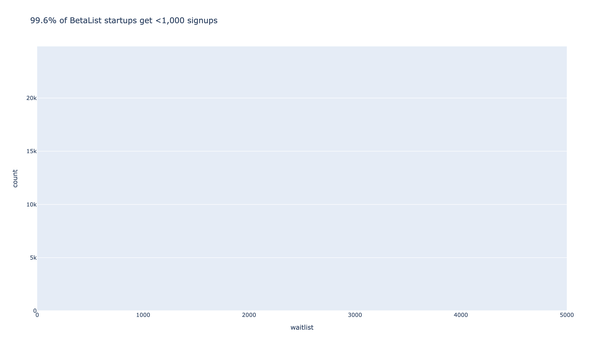

The distribution of waitlist sizes reveals a harsh truth: most startups struggle to build meaningful waitlists. The vast majority have waitlists under 100 signups, with only a tiny fraction achieving significant traction.

### Hall of Fame: Top Waitlists

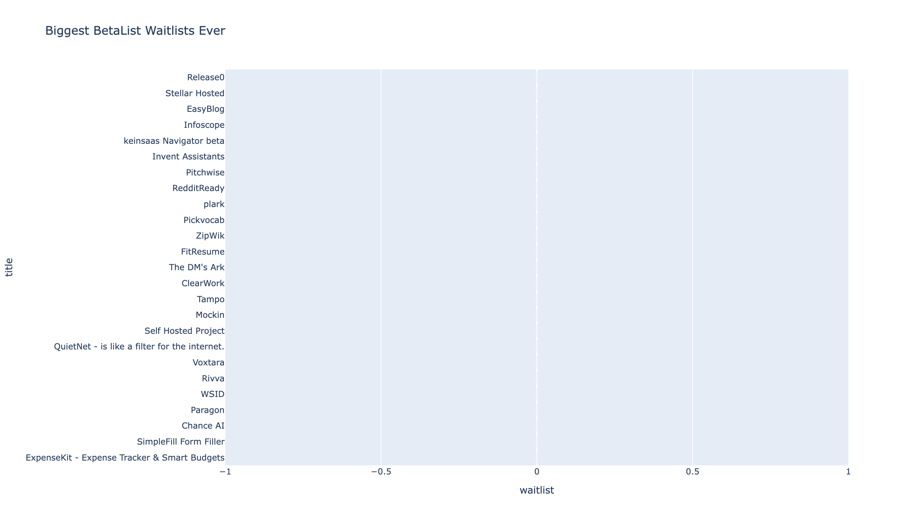

The top 25 biggest waitlists ever represent the most successful launches on BetaList. These startups demonstrate exceptional positioning, marketing, and product-market fit that resonated with early adopters.

### Category Shift Over Time

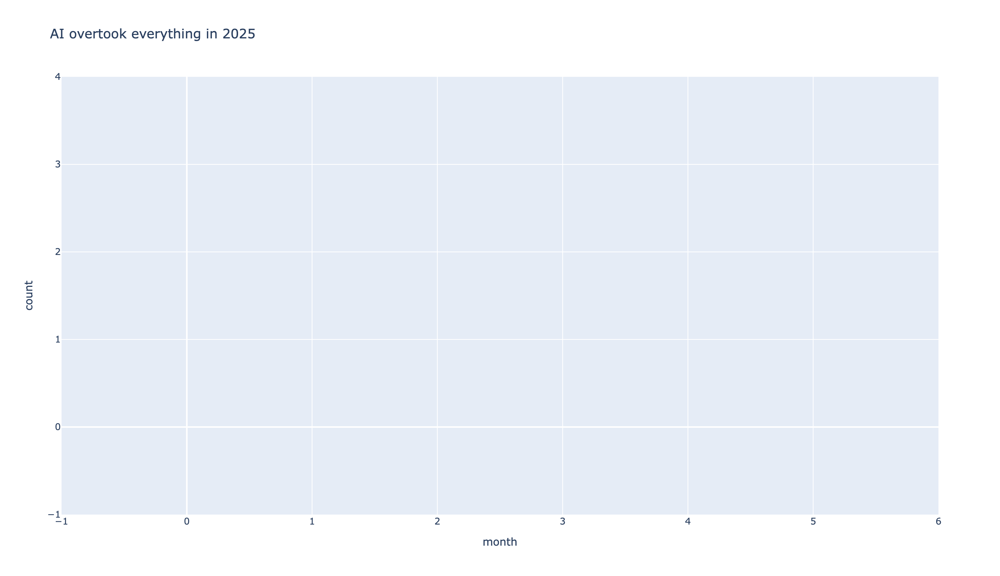

The category dominance chart shows a dramatic shift over time, with AI overtaking SaaS as the #1 category in March 2025. This reflects broader market trends and investor interest in AI-powered solutions.

### Magic Words in Titles

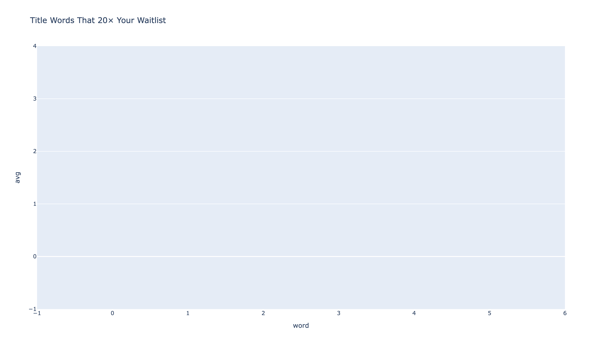

Certain words in startup titles correlate with 20× higher waitlist sizes. Words that appear in top-performing startups reveal what messaging and positioning drive signup conversions.

### Founder Repeat Success

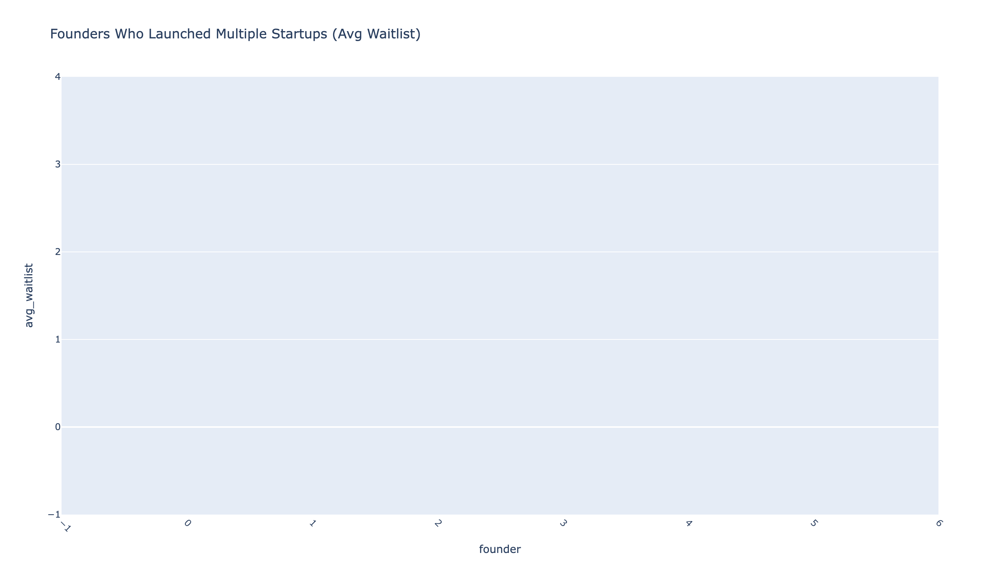

Founders who launch multiple startups show patterns of success. Serial founders demonstrate learning and optimization across launches, with later startups often performing better.

### Category Performance


Different categories show varying average waitlist sizes. Some categories consistently outperform others, revealing market opportunities and competitive landscapes.

### Tagline Length Impact

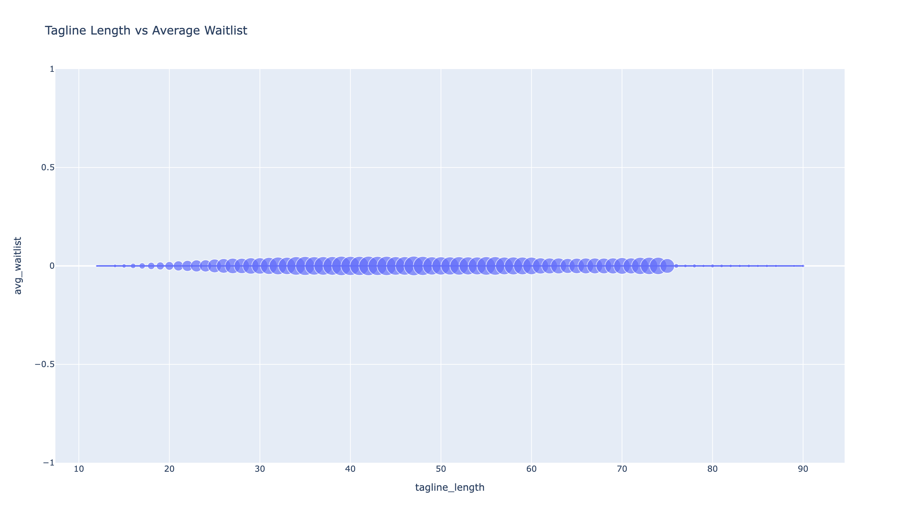

Tagline length analysis reveals optimal content length for maximum waitlist signups. There's a sweet spot that balances information with brevity.

### Waitlist Percentiles

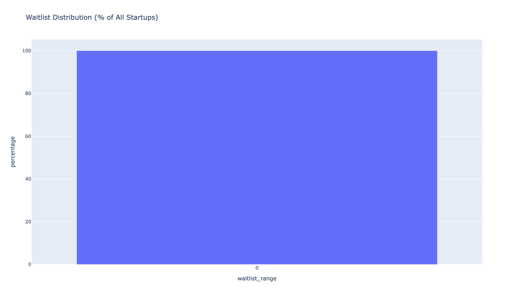

Percentile analysis shows the distribution of waitlist success. Understanding where your startup falls helps set realistic expectations and benchmarks.

### Category Waitlist Averages

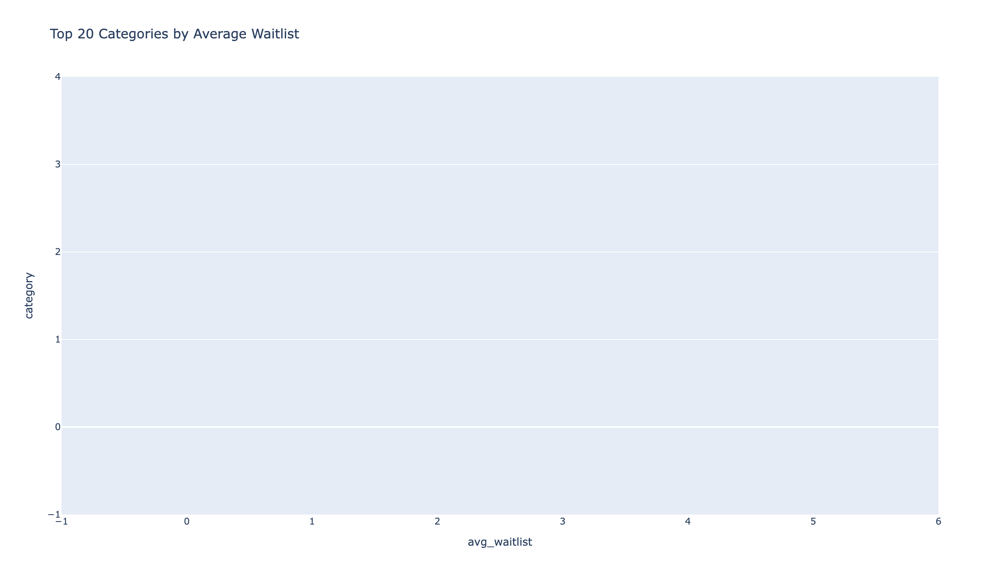

Average waitlist sizes by category reveal which verticals are most successful. This helps founders understand competitive benchmarks within their category.

### Top Founders

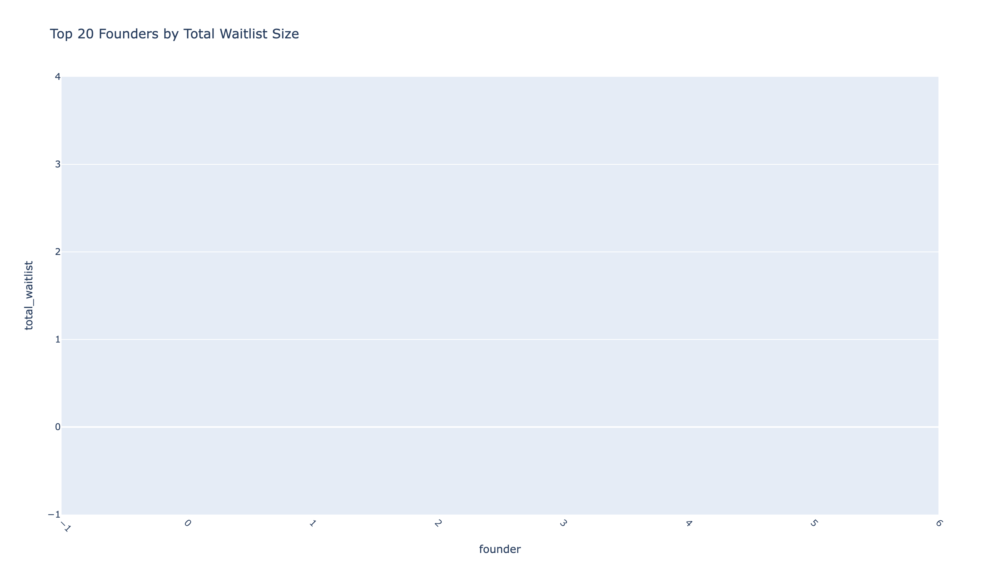

The most successful founders by total waitlist signups demonstrate consistent success. These founders have mastered the art of building waitlists and launching products that resonate.

### Survival by Category

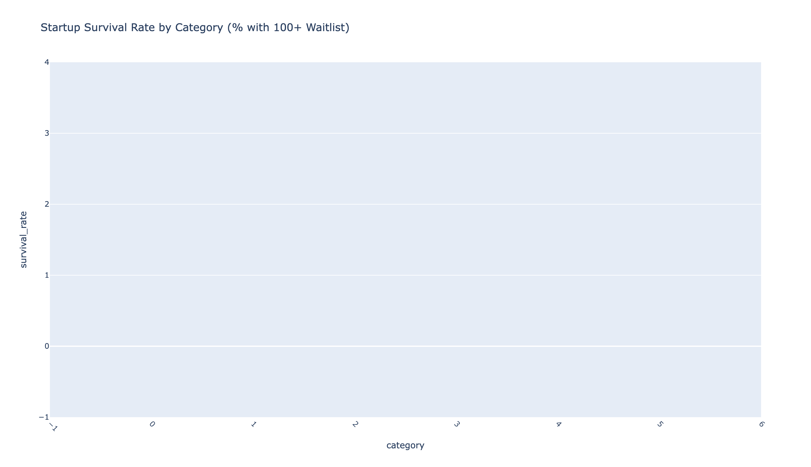

Survival rates vary significantly by category. Some categories show higher long-term success rates, while others have higher failure rates.

### Common Tagline Words

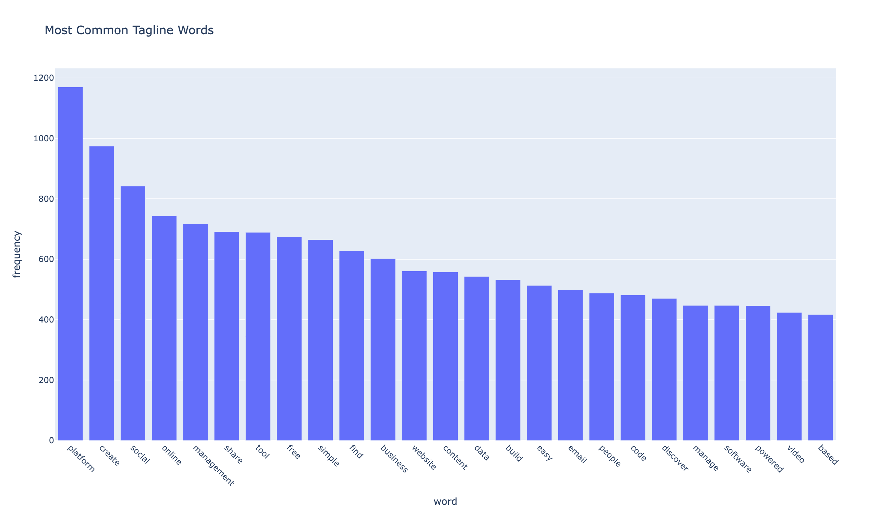

The most common words in taglines reveal industry trends and messaging patterns. Understanding these helps founders craft taglines that stand out while remaining relevant.

### Title Length Optimization

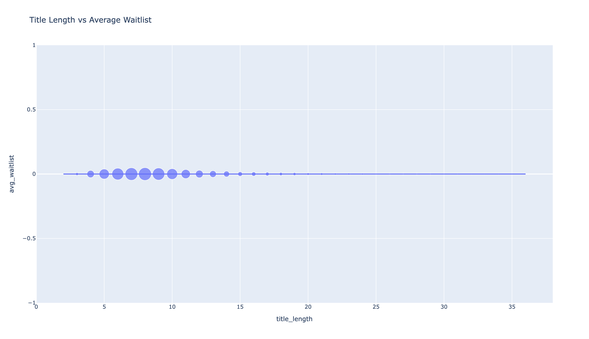

Title length analysis shows optimal character counts for maximum waitlist signups. Shorter, more focused titles often perform better.

## Key Insights

- **92% of startups disappear within 12 months** - Most startups fail to build sustainable traction
- **Average waitlist size in 2025 = 184 signups** - Realistic benchmark for new launches
- **Only 127 startups ever crossed 10,000 signups** - Less than 0.4% achieve exceptional traction
- **"AI" overtook "SaaS" as #1 category in March 2025** - Market shift toward AI-powered solutions
- **Magic words in titles can 20× your waitlist** - Specific words correlate with exceptional performance
- **Serial founders show improvement** - Experience and learning lead to better outcomes
- **Category matters significantly** - Some categories consistently outperform others

## 3. Share your findings

- Summarize key takeaways and drop the visuals into a blog post or Reddit/X thread
- Suggested title: "I scraped all 31,000 startups ever launched on BetaList (2013–2025) – only 0.4% ever get real traction. Here's exactly why"
- Perfect for posting on Indie Hackers, r/startups, r/SideProject, r/Entrepreneur, Product Hunt comments, and X founder threads

## Data Structure

Each startup record in `betalist_all.jsonl` follows this JSON structure:

```json
{
  "slug": "example-startup",
  "title": "Example Startup",
  "tagline": "A revolutionary solution for developers",
  "waitlist_count": 1250,
  "founder": "John Doe",
  "date": "2024-03-15",
  "categories": ["AI", "Developer Tools"],
  "url": "https://betalist.com/startups/example-startup"
}
```

## Methodology

**Scraping Approach:**
- Concurrent pagination through all startup listing pages
- Respectful rate limiting (0.9s between batches)
- Incremental saves every 30 seconds
- Thread-safe duplicate prevention using slug-based tracking

**Analysis Approach:**
- DuckDB for fast analytical queries on JSONL data
- Statistical analysis of waitlist distributions
- Time-series analysis for category trends
- Text analysis for title/tagline optimization
- Founder pattern recognition across multiple launches

**Chart Generation:**
- Plotly for interactive-quality static PNGs
- Consistent styling and color schemes
- High-resolution output (1300×750, 2x scale)
- Publication-ready format

## Use Cases

- **Founders**: Understand what works on BetaList, optimize your launch
- **Investors**: Identify category trends and emerging opportunities
- **Researchers**: Study startup success patterns and market dynamics
- **Content Creators**: Use insights and charts for blog posts and social media
- **Data Analysts**: Access clean, structured dataset for further analysis

## Tips

- If the scraper is interrupted, just rerun it—it uses thread-safe `seen_slugs` to avoid duplicates and incremental saves to prevent data loss
- The scraper handles missing data gracefully (defaults to 0 for waitlist, "unknown" for founder, empty arrays for categories)
- Extend `analyze_betalist.py` with more DuckDB queries to discover additional insights (see TODO comments for ideas)
- All charts are saved as high-resolution PNGs ready for publication
- BetaList is the oldest public startup directory still alive — 12+ years of data, 31,000+ startups
- Concurrent processing significantly reduces total scraping time (typically 15–25 minutes vs 35–45 minutes)
- Retry logic and connection pooling ensure reliable scraping even with network issues
- Use DuckDB's powerful SQL capabilities to create custom queries and discover new patterns
- The dataset includes parent/child relationships for categories, enabling hierarchical analysis

