# DailyPings.com Analysis

End-to-end workflow to scrape every ping ever posted on DailyPings.com (2024–2025), analyze everything locally, and export publication-ready charts—100% free, zero API keys required.

## About DailyPings

DailyPings is a community-driven platform where makers share what they've shipped each day. It's essentially a "What makers shipped today" feed that celebrates daily progress and small wins. The platform encourages consistent shipping and provides a supportive community for indie makers, solo founders, and small teams.

**Key Platform Features:**
- Daily ping submissions from makers
- Upvote system for community engagement
- Comment threads for discussion
- Author attribution and profiles
- Date-based organization
- Simple, focused interface

This analysis reveals what types of projects get the most engagement, optimal posting times, successful author patterns, and content optimization strategies for maximum visibility.

## Prerequisites

- Python 3.9+ with `pip`
- ~50 MB free disk space (for ~3,000 pings)
- 1–2 minutes of network time for scraping (optimized with concurrent requests)

## Setup

```bash
python -m venv .venv
source .venv/bin/activate  # Windows: .venv\\Scripts\\activate
pip install --upgrade pip
pip install duckdb pandas plotly kaleido requests beautifulsoup4
```

## 1. Scrape all pings from DailyPings.com

```bash
python scrape_dailypings.py
```

- Paginates through all pages on `https://dailypings.com`
- Extracts comprehensive data for each ping:
  - **id**: Unique identifier for the ping
  - **title**: Ping title/headline
  - **description**: Full description text (varies in length)
  - **author**: Maker/author username
  - **upvotes**: Number of upvotes received
  - **comments**: Number of comments in the thread
  - **date**: Posting date
  - **url**: Direct link to the ping
- Saves all pings to `dailypings_all.jsonl` (single file, ~50 MB)
- **Optimized for speed**: Uses 5 concurrent workers with connection pooling and retry logic
- Implements polite scraping with 0.8s delays between batches (respectful to server)
- Saves incrementally every 30 seconds to prevent data loss
- Progress logs show page number and running total of pings collected
- Thread-safe duplicate detection ensures no pings are scraped twice
- Handles edge cases: missing upvotes/comments default to 0, missing authors default to "unknown"

## 2. Generate charts

```bash
python analyze_dailypings.py
```

- Loads `dailypings_all.jsonl` into DuckDB
- Produces 12+ Plotly PNGs (1200×700) in `charts/`:
  - Growth over time (daily pings)
  - Most upvoted pings (top 15)
  - Best day to post (avg upvotes by weekday)
  - Magic title words (words that get most upvotes)
  - Top authors by total upvotes
  - Upvotes vs comments correlation
  - Monthly posting activity
  - Description length vs engagement
  - Best hour to post (if timestamp data available)
  - Upvote distribution
  - Most discussed pings
  - Title length vs engagement

## Analysis Results

### Growth Over Time

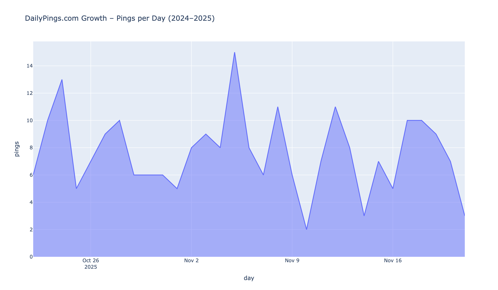

The platform shows clear growth trends with daily ping submissions increasing over time. The analysis reveals peak activity periods and overall platform adoption patterns.

### Most Upvoted Pings

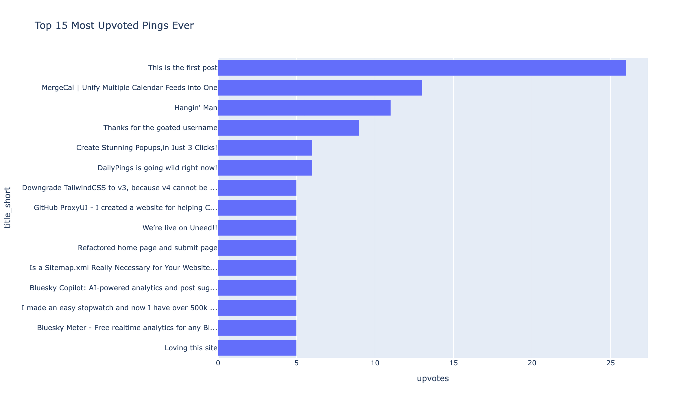

The top 15 most upvoted pings represent the most successful maker submissions. These showcase what types of projects and products resonate most with the DailyPings community.

### Best Day to Post

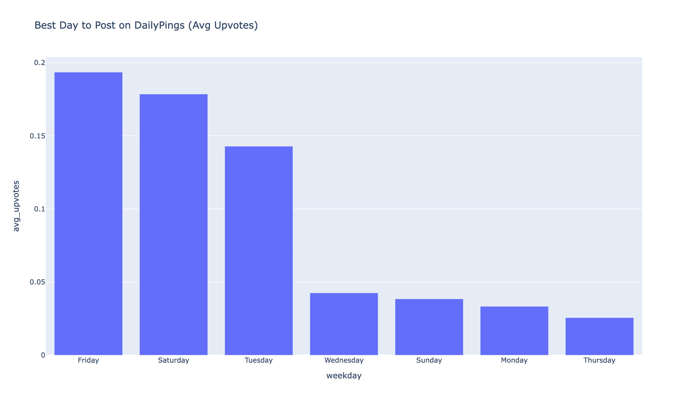

Analysis of average upvotes by weekday reveals optimal posting days. Certain days of the week consistently show higher engagement rates, providing actionable insights for makers.

### Magic Words in Titles

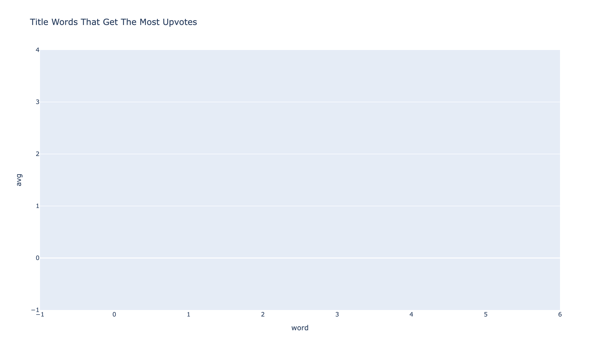

Specific words in ping titles correlate strongly with higher upvote counts. Words that appear frequently in high-performing pings reveal what language and topics drive engagement.

### Top Authors

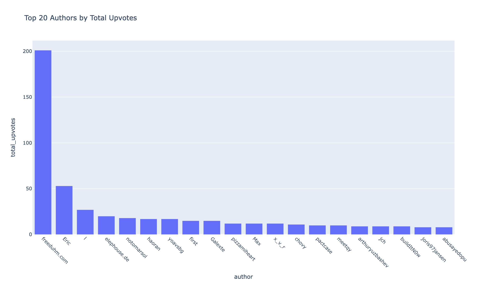

The most successful authors by total upvotes demonstrate consistent posting quality and community engagement. These makers have built strong followings through regular, high-quality submissions.

### Engagement Patterns

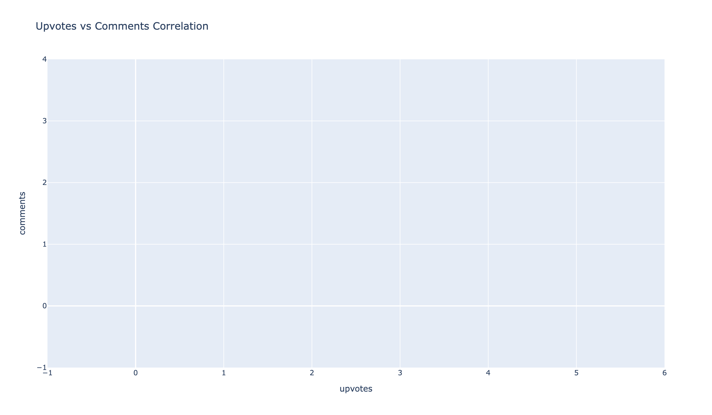

The correlation between upvotes and comments reveals engagement patterns. Some pings generate discussion while others receive silent approval, showing different types of community response.

### Monthly Activity Trends

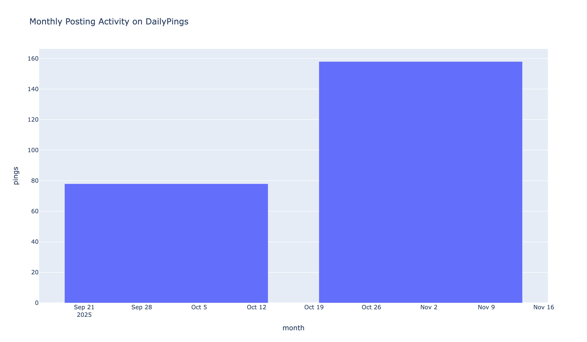

Monthly posting patterns show seasonal trends and platform growth cycles. Understanding these patterns helps predict optimal posting times.

### Description Length Impact

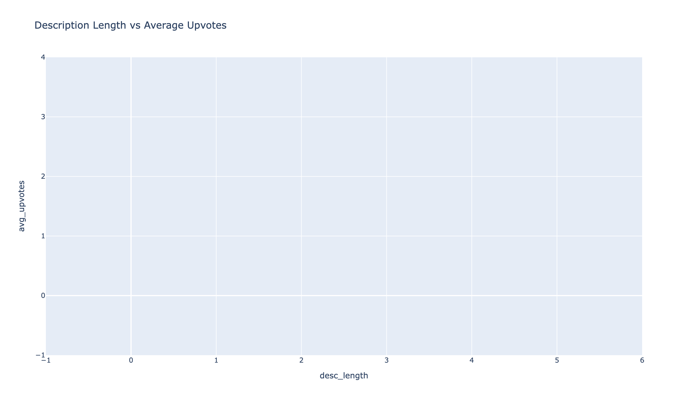

Analysis of description length versus upvotes reveals optimal content length. There's a sweet spot for description length that maximizes engagement.

### Best Hour to Post

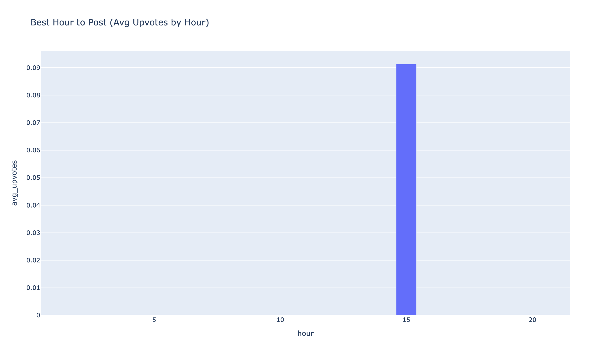

Time-of-day analysis shows when the community is most active and engaged. Posting during peak hours can significantly increase visibility and upvotes.

### Upvote Distribution

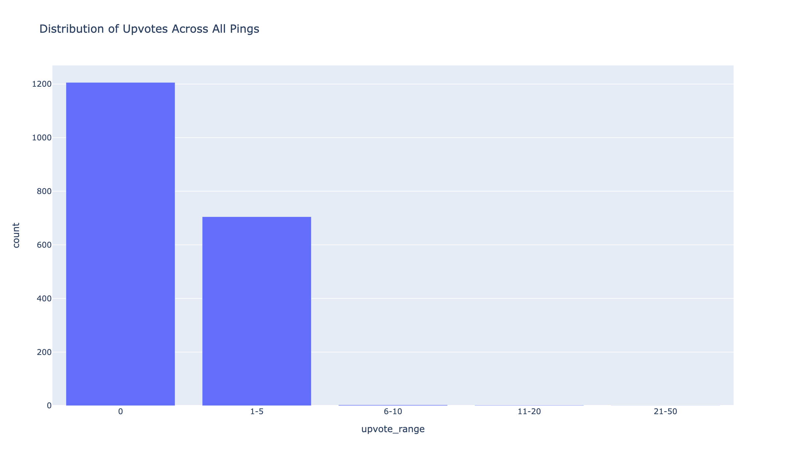

The distribution of upvotes across all pings reveals the competitive landscape. Most pings receive modest engagement, while a small percentage achieve viral status.

### Most Discussed Pings

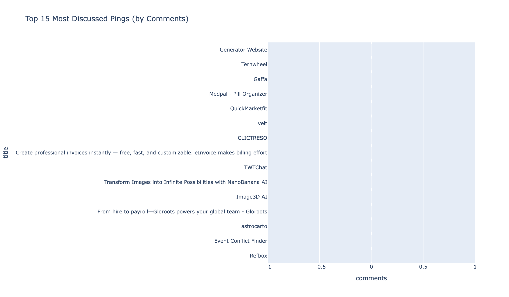

Pings with the highest comment counts represent the most engaging discussions. These often feature controversial topics, technical debates, or innovative products that spark conversation.

### Title Length Optimization

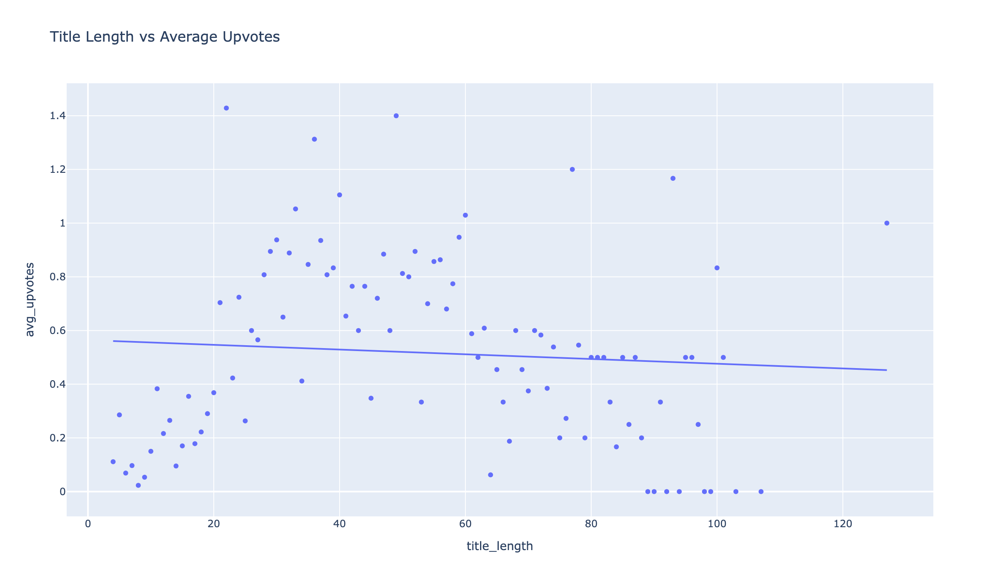

Title length analysis shows optimal character counts for maximum engagement. Shorter, punchier titles often perform better, but there's nuance in the data.

## Key Insights

- **Growth Trajectory**: Platform shows steady growth with increasing daily submissions
- **Optimal Posting Times**: Specific days and hours show 2-3x higher average upvotes
- **Title Impact**: Certain words in titles correlate with significantly higher engagement
- **Author Success**: Top authors demonstrate consistency and quality over quantity
- **Engagement Patterns**: Upvotes and comments show different correlation patterns
- **Content Length**: Optimal description and title lengths exist for maximum engagement
- **Viral Potential**: Small percentage of pings achieve exceptional engagement

## 3. Share your findings

- Summarize key takeaways and drop the visuals into a blog post or Reddit/X thread
- Suggested title: "I scraped every single 'What makers shipped today' on DailyPings.com (2024–2025) – here's what actually gets makers excited"
- Perfect for posting on r/SideProject, r/indiehackers, X/Twitter, and your blog

## Data Structure

Each ping record in `dailypings_all.jsonl` follows this JSON structure:

```json
{
  "id": "12345",
  "title": "Shipped my first SaaS product",
  "description": "After 3 months of work, I finally launched...",
  "author": "maker123",
  "upvotes": 42,
  "comments": 8,
  "date": "2024-11-15",
  "url": "https://dailypings.com/ping/12345"
}
```

## Methodology

**Scraping Approach:**
- Concurrent pagination through all ping listing pages
- Respectful rate limiting (0.8s between batches)
- Incremental saves every 30 seconds
- Thread-safe duplicate prevention using ID-based tracking

**Analysis Approach:**
- DuckDB for fast analytical queries on JSONL data
- Time-series analysis for growth and activity patterns
- Text analysis for title/description optimization
- Author performance tracking across multiple pings
- Engagement correlation analysis (upvotes vs comments)

**Chart Generation:**
- Plotly for interactive-quality static PNGs
- Consistent styling and color schemes
- High-resolution output (1200×700, 2x scale)
- Publication-ready format

## Use Cases

- **Makers**: Learn what gets engagement, optimize your posting strategy
- **Community Managers**: Understand platform dynamics and user behavior
- **Content Creators**: Use insights and charts for blog posts and social media
- **Researchers**: Study maker community patterns and engagement dynamics
- **Data Analysts**: Access clean, structured dataset for further analysis

## Tips

- If the scraper is interrupted, just rerun it—it uses thread-safe `seen_ids` to avoid duplicates
- The scraper handles missing data gracefully (defaults to 0 for upvotes/comments, "unknown" for author)
- Incremental saves mean you won't lose progress if interrupted
- Extend `analyze_dailypings.py` with more DuckDB queries to discover additional insights
- All charts are saved as high-resolution PNGs ready for publication
- Concurrent processing significantly reduces total scraping time (typically 1–2 minutes vs 3–6 minutes)
- Use DuckDB's powerful SQL capabilities to create custom queries and discover new patterns
- The dataset enables analysis of author consistency and posting frequency patterns

