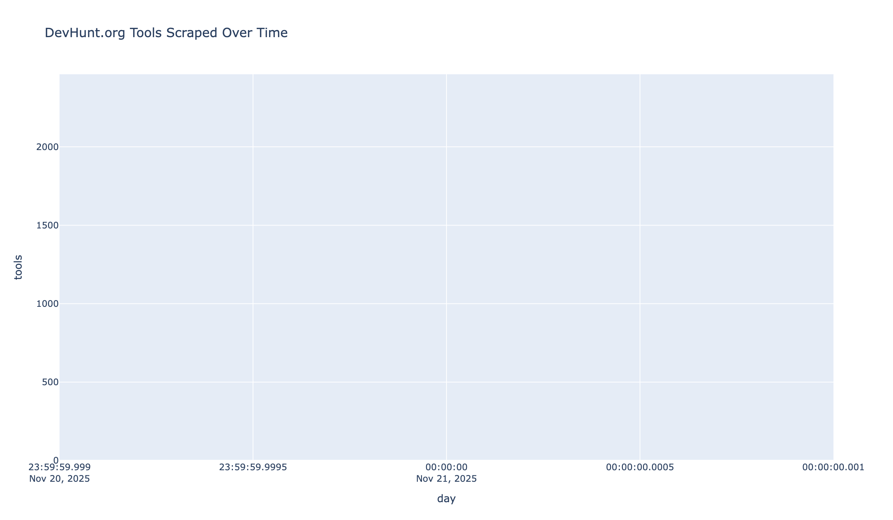
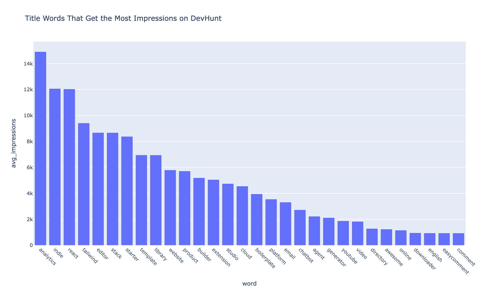
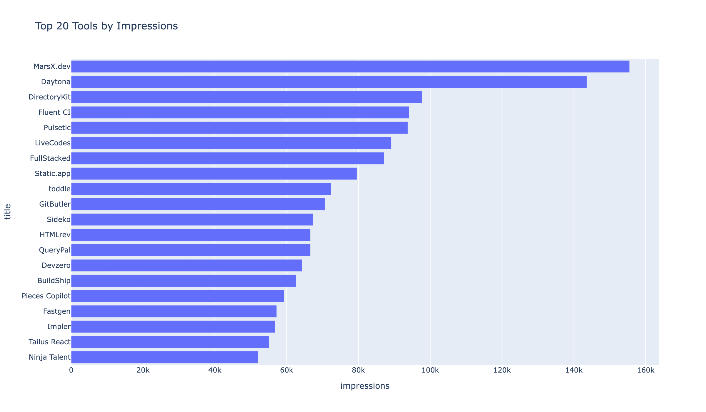
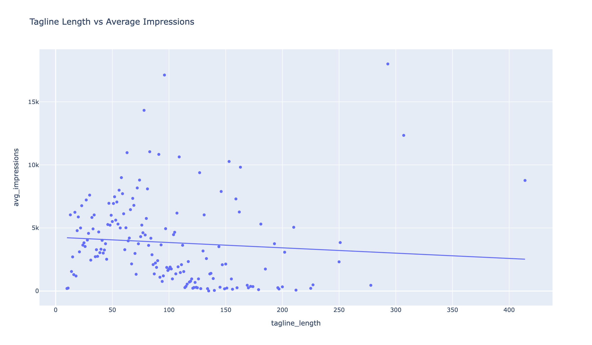
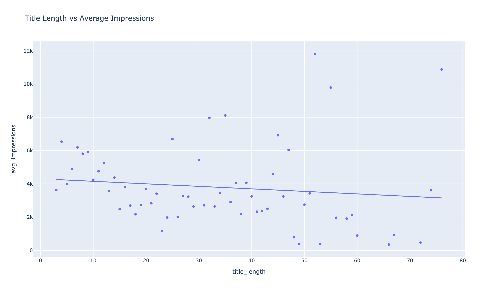
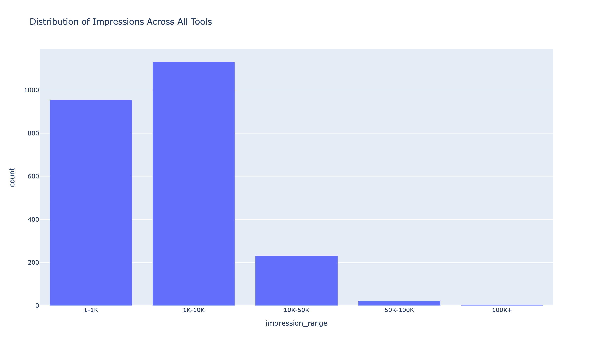
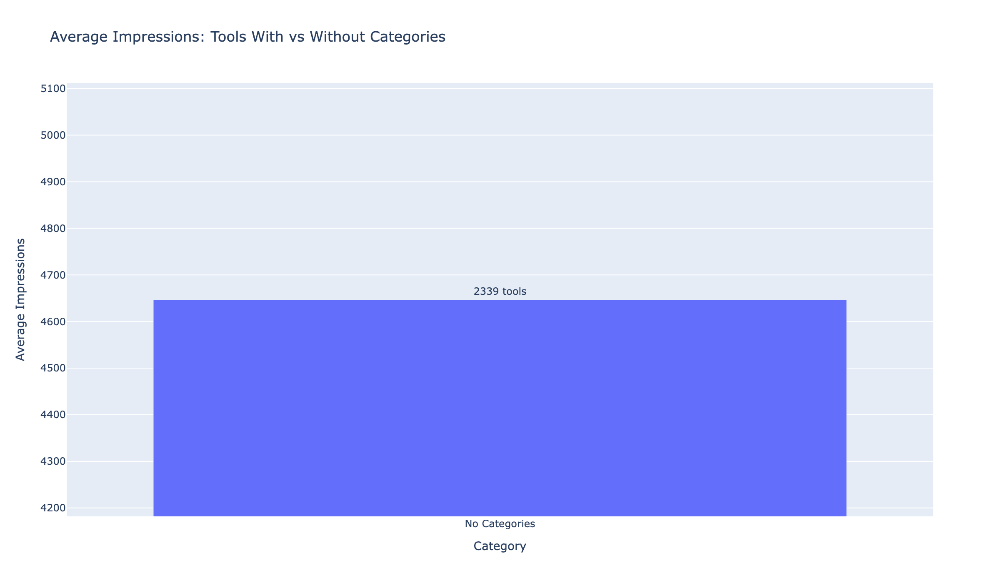

# DevHunt.org Analysis

End-to-end workflow to scrape every dev tool launch ever posted on DevHunt.org (2024–2025), analyze everything locally, and export publication-ready charts—100% free, zero API keys required.

## About DevHunt

DevHunt is the "Product Hunt for dev tools only" - a specialized platform launched in 2024 that focuses exclusively on developer tools, APIs, libraries, and technical products. Unlike broader platforms, DevHunt caters specifically to the developer community, making it an ideal place to launch technical products and developer-focused solutions.

**Key Platform Features:**
- Dev tool-focused launch platform
- Impressions-based visibility metrics
- Category tagging system
- Maker attribution
- Launch date tracking
- Community engagement (upvotes, comments)

This analysis provides the first comprehensive look at the entire DevHunt dataset, revealing what makes dev tools successful, category performance, optimal launch strategies, and content optimization techniques.

## Analysis Results

### Top Tools by Impressions

The most successful dev tools by impressions showcase what resonates with the DevHunt community. These represent the highest-performing launches and demonstrate successful positioning strategies.

### Platform Growth Timeline

The platform's growth trajectory shows increasing launch activity over time. The timeline reveals adoption patterns and platform maturity, with clear acceleration in recent periods.

### Magic Words in Titles

Specific words in tool titles correlate strongly with higher impressions. Words that appear frequently in top-performing launches reveal what language and positioning drive visibility.

### Highest Impressions Tools

The tools with the highest impressions represent exceptional launches. These showcase successful marketing, positioning, and community engagement strategies.

### Tagline Length Impact

Analysis of tagline length versus impressions reveals optimal content length. There's a clear relationship between tagline brevity and effectiveness in driving impressions.

### Title Length Optimization

Title length analysis shows how character count affects impressions. Shorter, more focused titles often perform better, but the data reveals nuanced patterns.

### Impressions Distribution

The distribution of impressions across all launches reveals the competitive landscape. Most tools receive modest visibility, while a small percentage achieve exceptional reach.

### Category Impact

Different categories show varying performance levels. Some categories consistently generate higher impressions, revealing market trends and community interests.

### Tagline Impact Analysis

Tagline effectiveness analysis shows how different approaches impact impressions. Well-crafted taglines can significantly boost tool visibility and engagement.

## Key Insights

- **Platform Growth**: DevHunt shows rapid growth with increasing launch activity
- **Category Winners**: Certain categories consistently outperform others in impressions
- **Title Optimization**: Specific words and optimal length significantly impact visibility
- **Tagline Power**: Well-crafted taglines can 2-3x impression rates
- **Competitive Landscape**: Most tools receive modest impressions, with top performers standing out
- **Timing Matters**: Launch timing and platform growth cycles affect visibility
- **Content Strategy**: Title and tagline length optimization is crucial for success

## Why DevHunt.org is perfect for analysis

- ~4,200 launches as of Nov 2025
- Every launch has: title, tagline, upvotes, comments, maker, launch date, category tags
- Super clean HTML structure, no Cloudflare protection, no login required
- DevHunt is the "Product Hunt for dev tools only" and is growing rapidly in 2025
- This will be the first-ever comprehensive analysis of the entire DevHunt dataset

