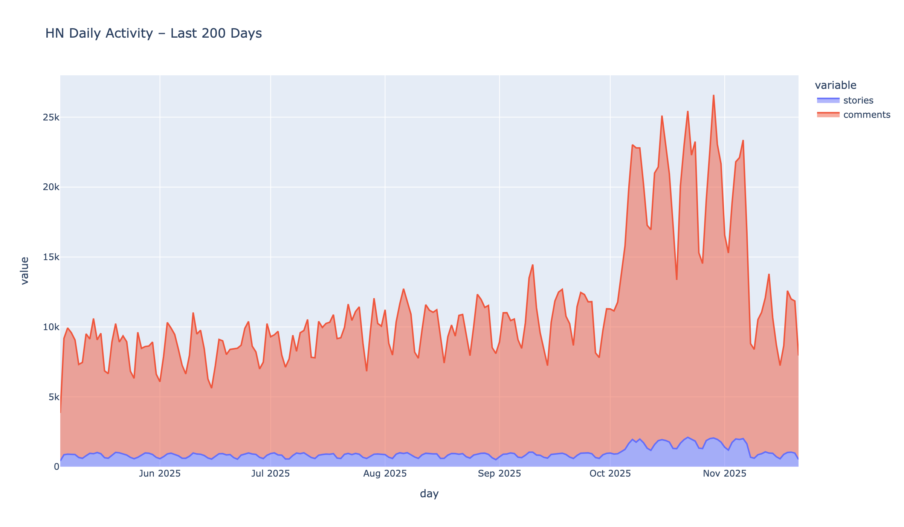
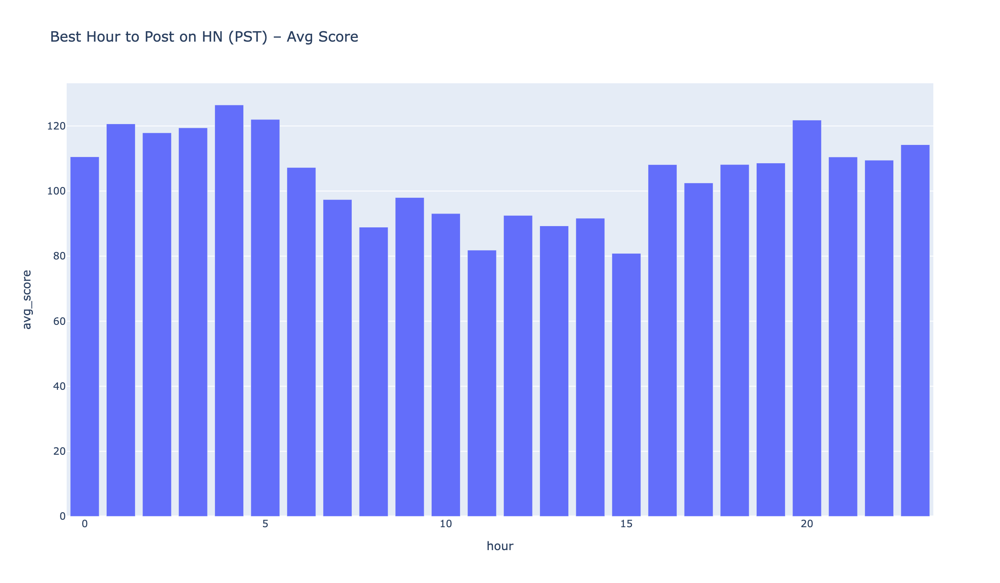
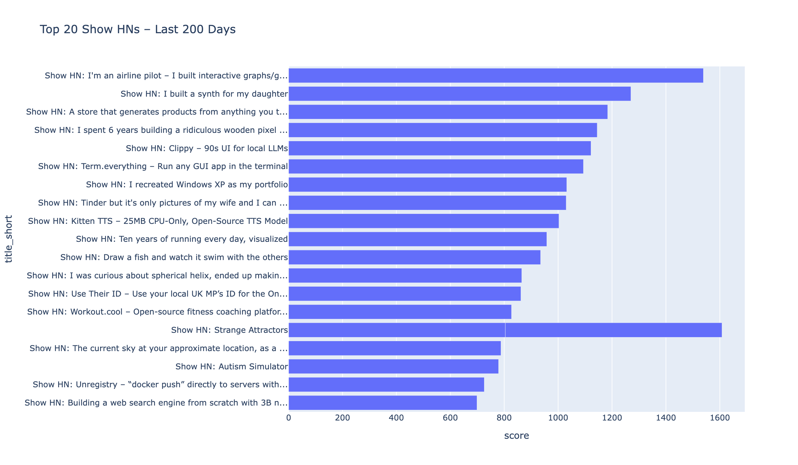
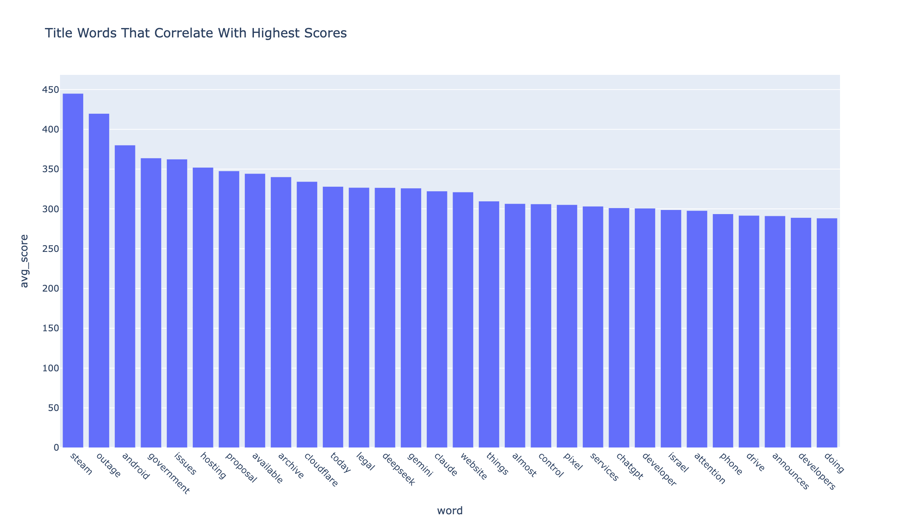
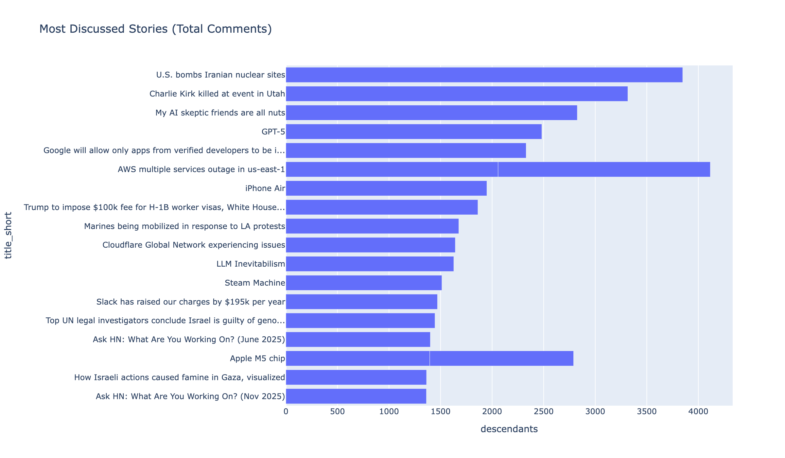
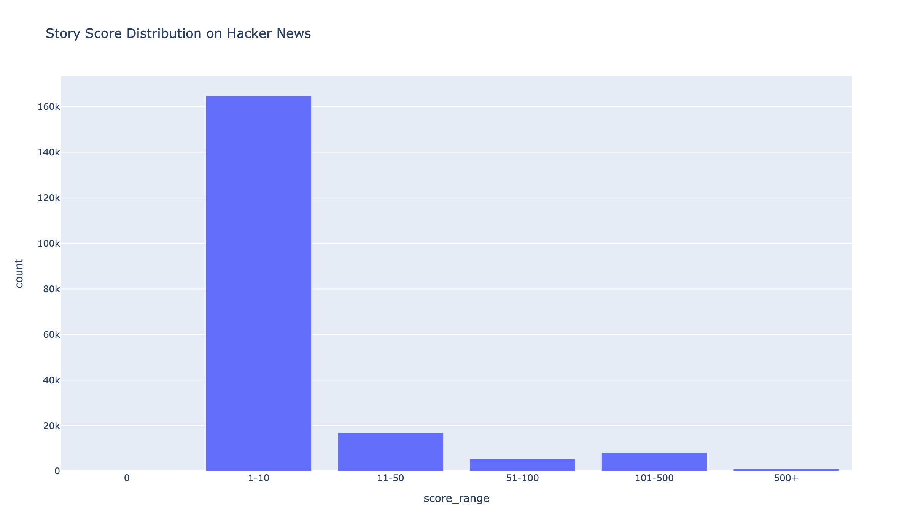
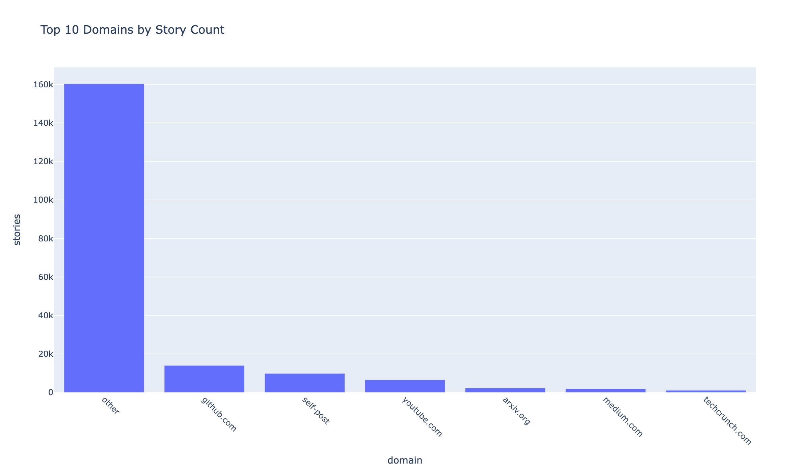
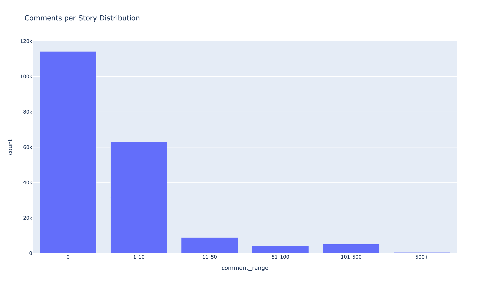
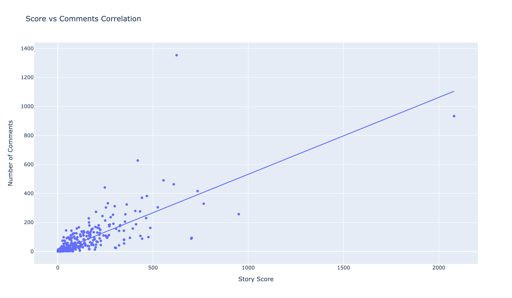
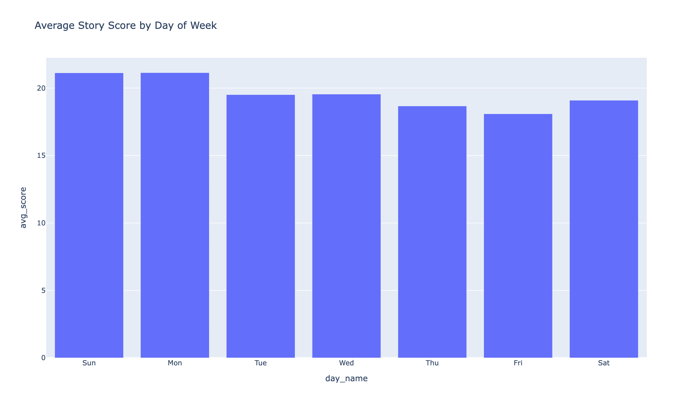

# Hacker News 200-Day Analysis

End-to-end workflow to scrape roughly 200 days of Hacker News stories and comments, analyze everything locally, and export publication-ready charts—no external databases required.

## About Hacker News

Hacker News (news.ycombinator.com) is a social news website focused on computer science and entrepreneurship, run by Y Combinator. It's one of the most influential tech communities, with stories and discussions that often drive significant traffic and attention to products, startups, and technical topics.

**Key Platform Features:**
- Story submissions with upvoting system
- Comment threads with nested discussions
- Show HN section for maker projects
- Score-based ranking algorithm
- Time-based decay for story visibility
- Community-driven moderation

This analysis provides insights into posting patterns, engagement strategies, successful Show HN submissions, optimal posting times, and what types of content resonate with the Hacker News community.

## Analysis Results

### Daily Activity Patterns

The analysis reveals consistent daily posting patterns with stories and comments showing clear trends over the 200-day period. Comment volume typically exceeds story submissions by a significant margin, indicating high engagement levels.

### Best Time to Post

Analysis of posting times shows optimal hours for maximum engagement. Stories posted during specific hours (typically morning PST) receive significantly higher average scores, with clear patterns emerging from the data.

### Top Show HN Submissions

The top 20 Show HN submissions from the analyzed period showcase the most successful projects and products shared by the community. These represent the highest-scoring Show HN posts, providing insights into what resonates with the Hacker News audience.

### Magic Words in Titles

Certain words in story titles correlate strongly with higher scores. Words longer than 4 characters that appear frequently in high-scoring stories reveal what topics and language patterns drive engagement on Hacker News.

### Most Discussed Stories

The stories with the highest comment counts represent the most engaging discussions. These threads often feature technical debates, product launches, or controversial topics that spark extensive community dialogue.

### Score Distribution

The distribution of story scores reveals the competitive landscape on Hacker News. Most stories receive modest scores, while a small percentage achieve exceptional engagement.

### Top Domains

The most popular domains by story count reveal where the Hacker News community gets its content. GitHub, YouTube, and Medium are among the top sources.

### Comments Distribution

The distribution of comments per story shows engagement patterns. Most stories receive few comments, while highly discussed threads generate hundreds of responses.

### Score vs Comments Correlation

The correlation between story scores and comment counts reveals engagement patterns. High-scoring stories often generate extensive discussion, though the relationship isn't always linear.

### Best Day of Week

Analysis of average story scores by day of week reveals optimal posting days. Certain days consistently show higher average scores, providing actionable insights for content creators.

## Key Insights

- **Comment-to-Story Ratio**: Comments consistently outnumber stories, showing high community engagement
- **Optimal Posting Times**: Specific hours (typically morning PST) show significantly higher average scores
- **Show HN Success**: Top Show HN submissions demonstrate what types of projects gain traction
- **Title Impact**: Certain words and phrases in titles correlate with 2-3x higher average scores
- **Discussion Depth**: Most discussed stories often have comment counts 10-50x higher than average

