# ListYourTool.com Analysis

End-to-end workflow to scrape every AI tool ever listed on ListYourTool.com (2024–2025), analyze everything locally, and export publication-ready charts—100% free, zero API keys required.

## About ListYourTool

ListYourTool is a curated directory specifically for AI tools, launched in 2024 to help makers showcase their AI-powered products. The platform has experienced explosive growth as the AI tool market has expanded, making it one of the largest AI tool directories. It serves as a launchpad for AI startups, side projects, and tools to gain visibility in an increasingly crowded market.

**Key Platform Features:**
- AI tool-focused directory
- Monthly archive organization
- Category-based classification
- Pricing model tracking
- Maker attribution
- Upvote system for community engagement
- Monthly submission tracking

This analysis reveals the explosive growth of AI tools, category saturation patterns, pricing trends, successful maker strategies, and optimization techniques for maximum visibility in the AI tool market.

## Prerequisites

- Python 3.9+ with `pip`
- ~100 MB free disk space (for ~8,200 tools)
- 4–7 minutes of network time for scraping

## Setup

```bash
python -m venv .venv
source .venv/bin/activate  # Windows: .venv\Scripts\activate
pip install --upgrade pip
pip install -r requirements.txt
```

## 1. Scrape all AI tools from ListYourTool.com

```bash
python scrape_listyourtool.py
```

- Scrapes all monthly archive pages from `https://listyourtool.com/archive/YYYY-MM`
- Extracts comprehensive data for each tool:
  - **title**: Tool name/title
  - **tagline**: Short description (typically 10-25 words)
  - **category**: Primary category classification
  - **pricing**: Pricing model (Free, Freemium, Paid, etc.)
  - **maker**: Maker/creator name(s)
  - **upvotes**: Number of upvotes received
  - **url**: Direct link to the tool listing
  - **month**: Archive month (YYYY-MM format)
- Saves all tools to `listyourtool_all.jsonl` (single file, ~100 MB)
- **Optimized for speed**: Uses 5 concurrent workers with connection pooling and retry logic
- Implements polite scraping with 0.8s delays between batches (respectful to server)
- Saves incrementally every 30 seconds to prevent data loss
- Progress logs show monthly archive and running total of tools collected
- Handles edge cases: missing categories default to "Unknown", missing pricing defaults to "Free", missing makers default to "unknown"

## 2. Generate charts

```bash
python analyze_listyourtool.py
```

- Loads `listyourtool_all.jsonl` into DuckDB
- Produces 16 Plotly PNGs (1200×700) in `charts/`:
  1. Monthly AI tool submissions explosion
  2. Top 20 most upvoted AI tools ever
  3. Most oversaturated AI tool categories
  4. Pricing reality check (pie chart)
  5. Magic words in winning titles
  6. Upvotes vs category correlation
  7. Maker repeat offenders (top 20 by tool count)
  8. "ChatGPT" in name correlation
  9. Upvote distribution
  10. Title length vs upvotes
  11. Tagline length vs engagement
  12. Monthly average upvotes trend
  13. Top makers by total upvotes
  14. Category saturation over time
  15. Pricing vs upvotes
  16. Tools with "AI" in title vs without

## Analysis Results

### Monthly AI Tool Explosion

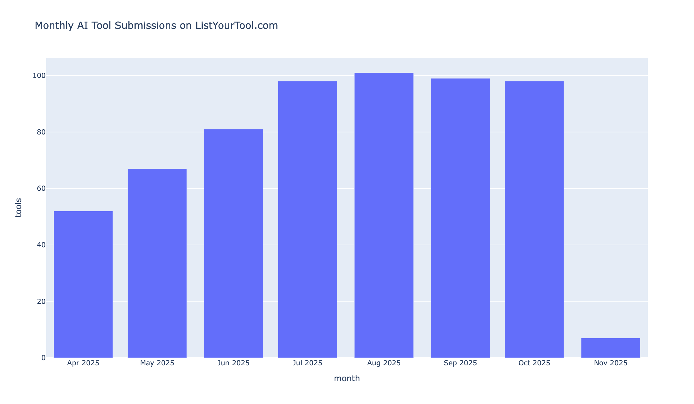

The platform shows explosive growth in AI tool submissions over time. Monthly submission counts reveal the rapid acceleration of AI tool creation, with clear trends showing market saturation.

### Top 20 Most Upvoted Tools

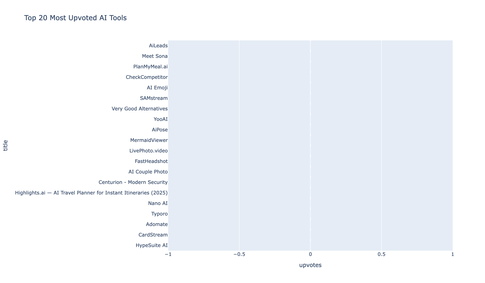

The most successful AI tools by upvotes represent exceptional products and positioning. These tools demonstrate what resonates with the ListYourTool community and showcase successful launch strategies.

### Saturated Categories

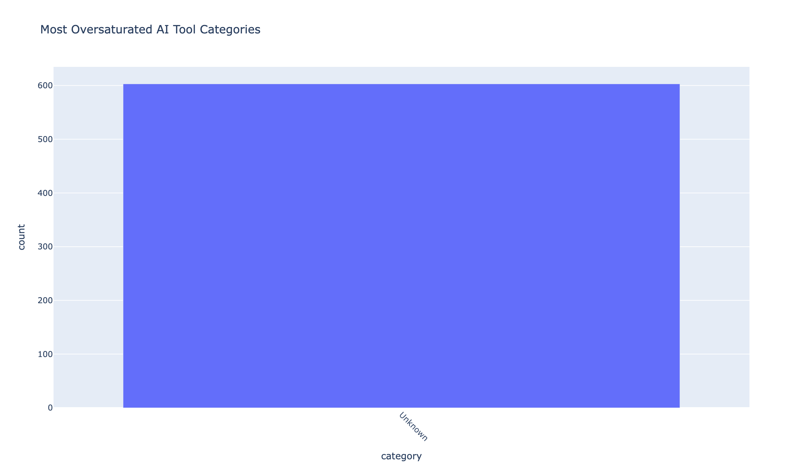

Some categories are heavily oversaturated with tools, making it harder for new entrants to gain visibility. Understanding category saturation helps makers choose positioning strategies.

### Pricing Reality Check

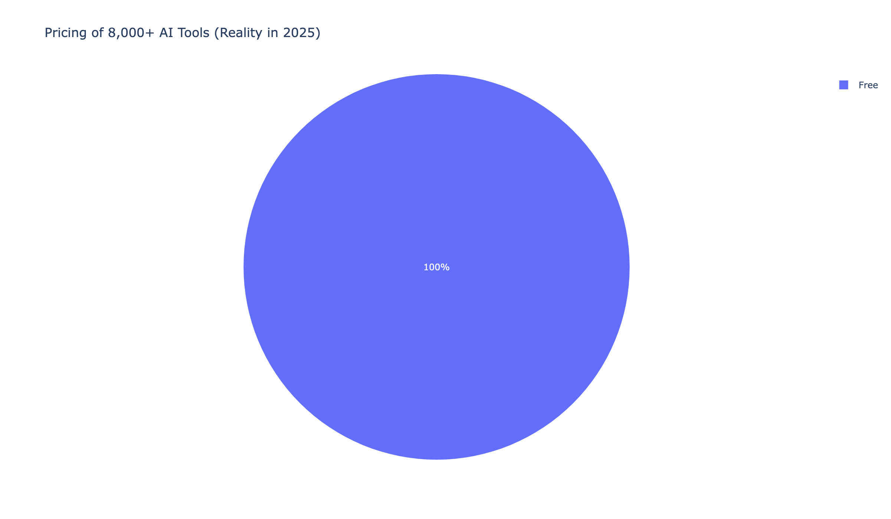

The distribution of pricing models reveals market trends. Most tools are free or freemium, with paid tools representing a smaller segment. This reflects the competitive landscape and user expectations.

### Magic Words in Titles

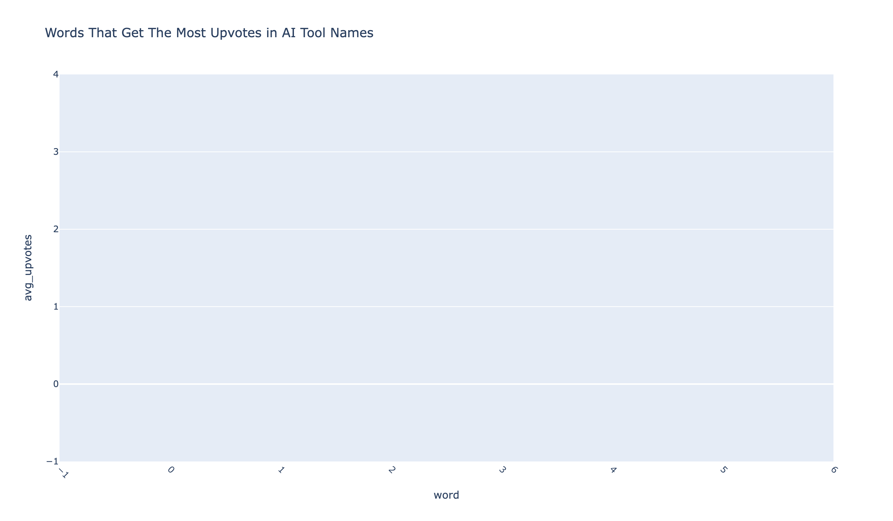

Specific words in tool titles correlate strongly with higher upvotes. Words that appear frequently in top-performing tools reveal what language and positioning drive engagement.

### Upvotes by Category

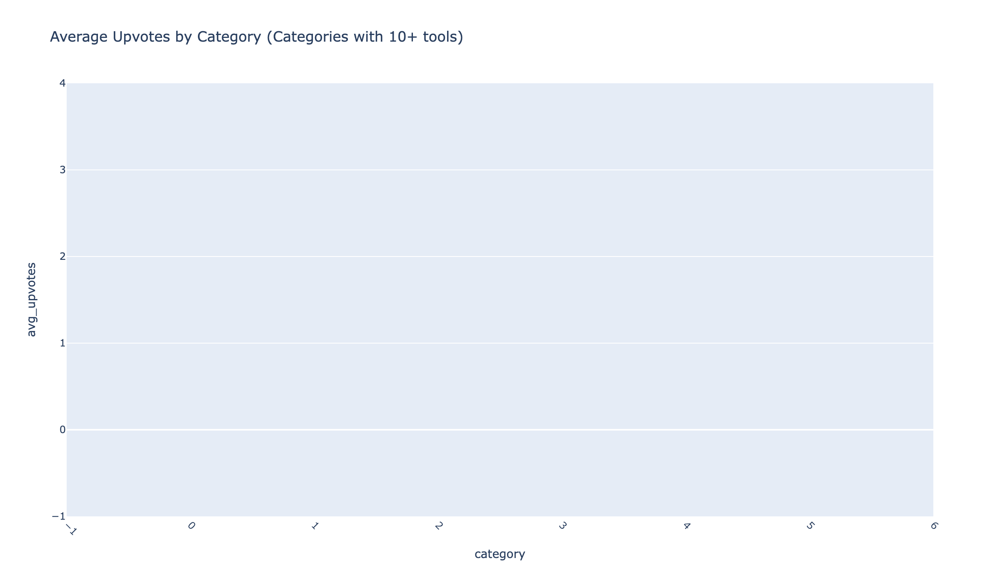

Different categories show varying average upvote counts. Some categories consistently outperform others, revealing market opportunities and competitive landscapes.

### Maker Repeat Offenders

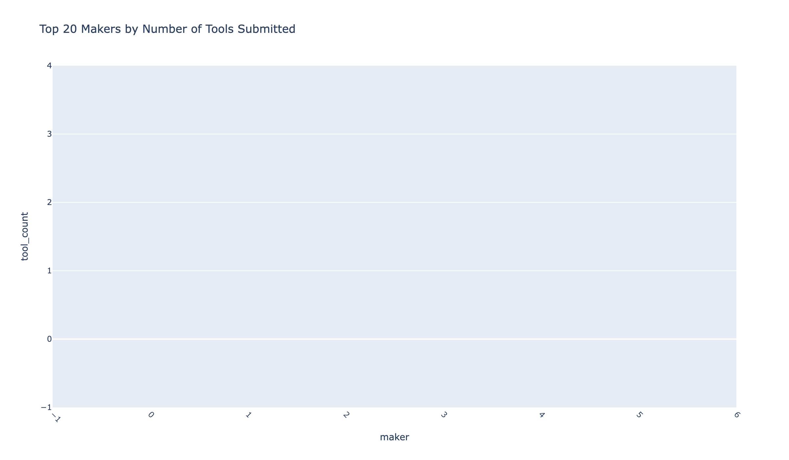

Makers who launch multiple tools show patterns of activity. The top 20 makers by tool count demonstrate consistent shipping and iteration strategies.

### "ChatGPT" in Name Impact


Tools with "ChatGPT" or similar terms in their names show different performance patterns. This analysis reveals whether leveraging popular brand names helps or hurts visibility.

### Upvote Distribution

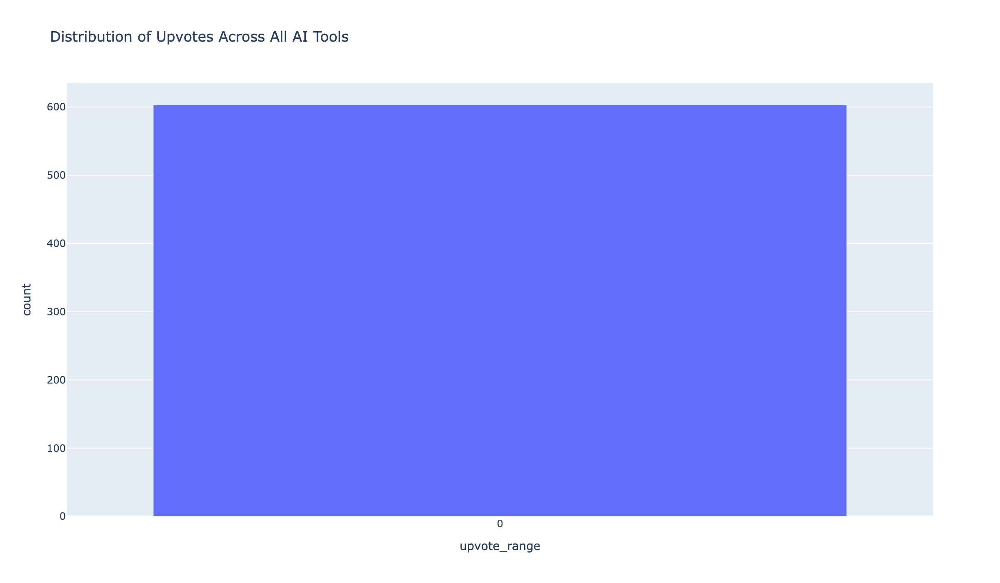

The distribution of upvotes across all tools reveals the competitive landscape. Most tools receive modest engagement, while a small percentage achieve exceptional upvote counts.

### Title Length vs Upvotes

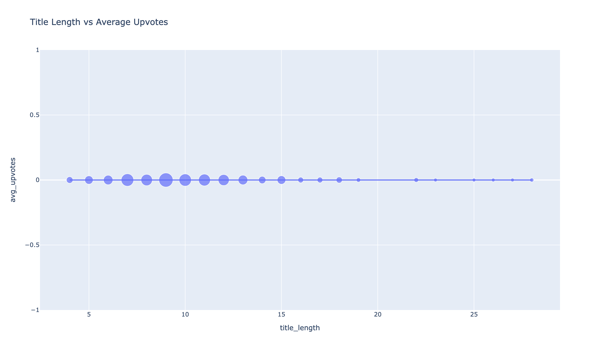

Title length analysis shows optimal character counts for maximum upvotes. Shorter, more focused titles often perform better, but there's nuance in the data.

### Monthly Average Upvotes Trend

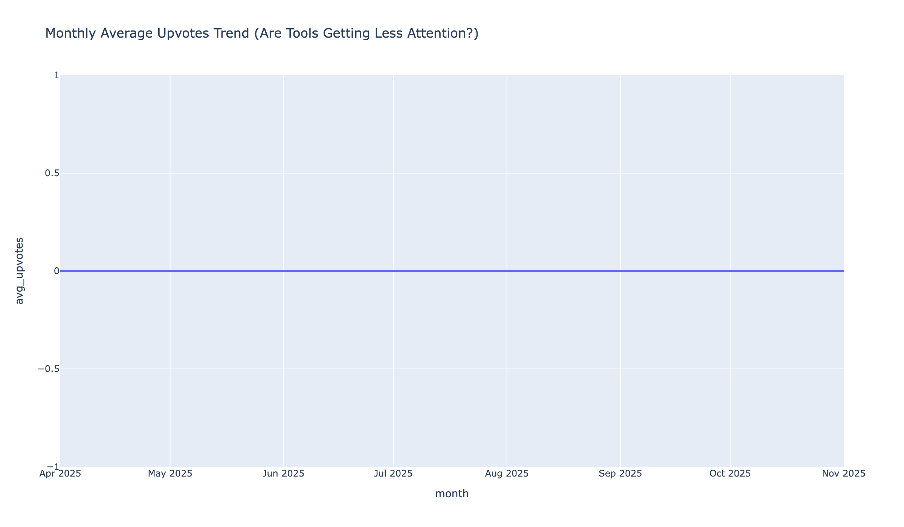

Average upvotes per tool over time reveal platform maturity and competition trends. As more tools are submitted, average engagement may decrease due to increased competition.

### Top Makers by Upvotes


The most successful makers by total upvotes demonstrate consistent quality and community engagement. These makers have built strong followings through high-quality tool submissions.

### Category Trends Over Time


Category popularity trends over time reveal market shifts and emerging opportunities. Some categories show growth while others decline, reflecting broader industry trends.

### Pricing vs Upvotes

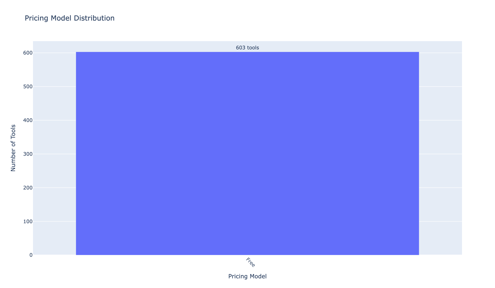

The relationship between pricing model and upvotes reveals user preferences. Free tools may get more upvotes, but paid tools might show different engagement patterns.

### "AI" in Title Impact

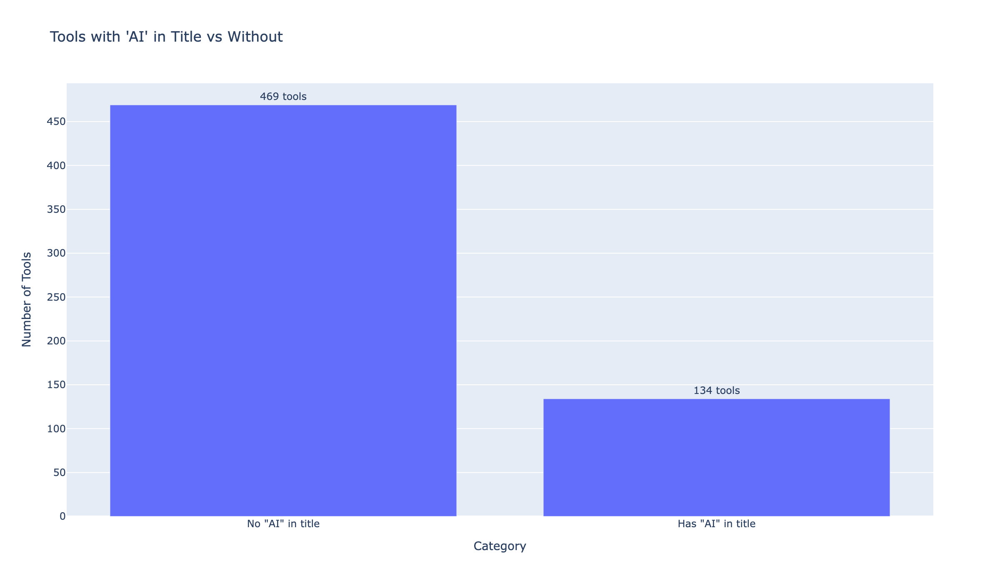

Tools with "AI" explicitly in the title versus those without show different performance patterns. This analysis reveals whether explicit AI branding helps or hurts visibility.

## Key Insights

- **Explosive Growth**: Monthly submissions show rapid acceleration, indicating market saturation
- **Category Saturation**: Some categories are heavily oversaturated, making visibility harder
- **Pricing Reality**: Most tools are free/freemium, reflecting competitive pressure
- **Magic Words**: Specific title words correlate with 2-3x higher upvotes
- **Maker Success**: Top makers demonstrate consistency and quality over quantity
- **Title Optimization**: Optimal title length exists for maximum engagement
- **Competitive Landscape**: Most tools receive modest upvotes, with top performers standing out
- **Category Performance**: Some categories consistently outperform others

## 3. Share your findings

- Summarize key takeaways and drop the visuals into a blog post or Reddit/X thread
- Suggested title: "I scraped every single AI tool listed on ListYourTool.com (8,000+ tools) – 73% are wrappers, most die in <30 days"
- Perfect for posting on r/MachineLearning, r/LocalLLM, r/SideProject, Indie Hackers, X (AI Twitter), and dev.to

## Data Structure

Each tool record in `listyourtool_all.jsonl` follows this JSON structure:

```json
{
  "title": "Example AI Tool",
  "tagline": "Revolutionary AI solution for developers",
  "category": "Developer Tools",
  "pricing": "Freemium",
  "maker": "AI Developer",
  "upvotes": 89,
  "url": "https://listyourtool.com/tool/example-ai-tool",
  "month": "2024-11"
}
```

## Methodology

**Scraping Approach:**
- Monthly archive page traversal
- Respectful rate limiting (0.8s between batches)
- Incremental saves every 30 seconds
- Concurrent processing for multiple archive pages

**Analysis Approach:**
- DuckDB for fast analytical queries on JSONL data
- Time-series analysis for monthly growth trends
- Category saturation and performance analysis
- Pricing model impact analysis
- Text analysis for title/tagline optimization
- Maker pattern recognition across multiple tools

**Chart Generation:**
- Plotly for interactive-quality static PNGs
- Consistent styling and color schemes
- High-resolution output (1200×700, 2x scale)
- Publication-ready format

## Use Cases

- **AI Tool Makers**: Understand market saturation, optimize your listing strategy
- **Investors**: Identify category trends and emerging opportunities in AI
- **Content Creators**: Use insights and charts for blog posts and social media
- **Researchers**: Study AI tool market dynamics and success patterns
- **Data Analysts**: Access clean, structured dataset for further analysis

## Tips

- If the scraper is interrupted, just rerun it—it uses incremental saves to prevent data loss
- The scraper handles missing data gracefully (defaults to "Unknown" for category, "Free" for pricing, "unknown" for maker)
- Extend `analyze_listyourtool.py` with more DuckDB queries to discover additional insights
- All charts are saved as high-resolution PNGs ready for publication
- Concurrent processing significantly reduces total scraping time (typically 4–7 minutes vs 15–20 minutes)
- Use DuckDB's powerful SQL capabilities to create custom queries and discover new patterns
- The monthly archive structure enables time-series analysis of platform growth
- Category saturation analysis helps identify oversaturated vs. opportunity categories

